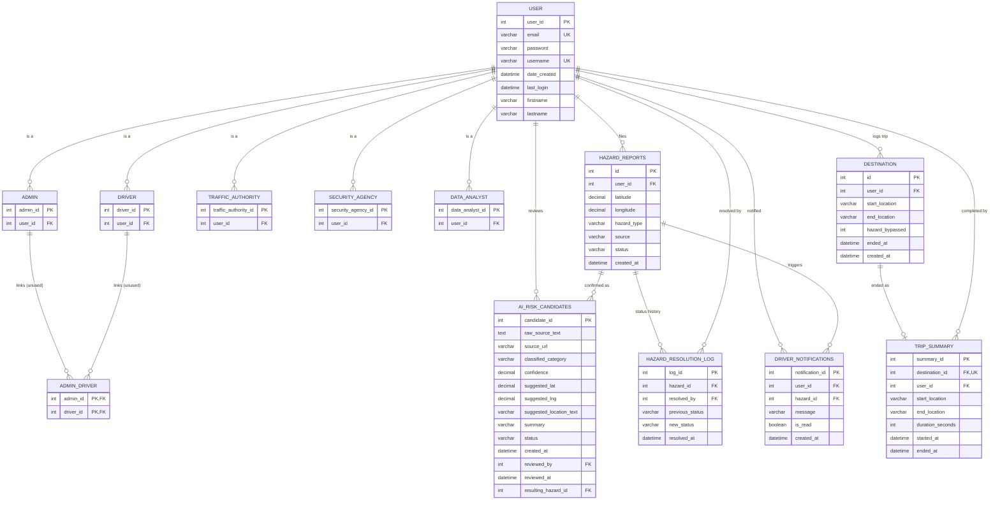

# Mapper — Entity-Relationship Diagram

Reflects the final schema after Phases 1, 2 and 6 (AI candidates, stored-procedure-backed
audit tables, and notification-only alerts). Canonical DDL: [`src/db/schema.sql`](../src/db/schema.sql).
DBML source (paste into [dbdiagram.io](https://dbdiagram.io) for an interactive diagram):
[`schema.dbml`](./schema.dbml).

`schema_migrations` (migration-tooling bookkeeping, not part of the application's
data model) is omitted from both diagrams below.

## Diagram

## Table groups

**Identity & roles** — `user`, `driver`, `admin`, `traffic_authority`, `security_agency`,
`data_analyst`, `admin_driver` (legacy, unused). A user's role is purely which subtype
table contains their `user_id` — there is no `role` column anywhere.

**Core operations** — `hazard_reports` (every danger-zone report, tagged by `source` so
citizen reports are distinguishable from official Traffic Authority / Security Agency
ones) and `destination` (a driver's logged trip; `ended_at IS NULL` means still in
progress).

**Phase 1 — AI feature** — `ai_risk_candidates`. News → LLM classification → geocode →
pending candidate. A human reviewer confirms (inserts a real `hazard_reports` row,
`source='ai_confirmed'`) or rejects (no further effect). See
[`AI-FEATURE.md`](./AI-FEATURE.md).

**Phase 2 — stored procedures** — `hazard_resolution_log` (written by `sp_resolve_hazard`
on every status change) and `trip_summary` (written by `sp_end_trip`, with a
server-computed `duration_seconds`). Both are audit/derived tables a stored procedure
owns exclusively — the routes never write to them directly.

**Phase 6 — notifications** — `driver_notifications`. Deliberately not named `alerts`:
the backend's SafeMaster port has a dormant query against a table literally named
`alerts` that silently no-ops today. Naming this table `alerts` would make that query
start succeeding and pull real data into routing scores automatically, while the
frontend TS port (which has no such hook) would not — silently breaking the two ports'
parity (parallel-port Rule 3). `driver_notifications` stays intentionally disconnected
from SafeMaster scoring; it is purely a notification-center feed.
